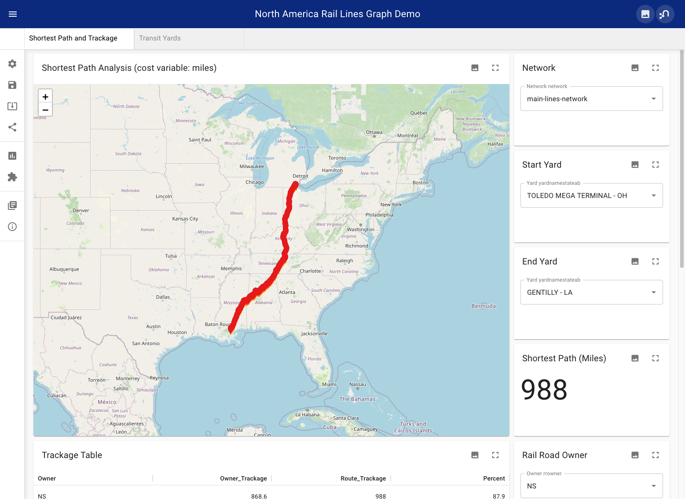

# neo4j-na-rail-network
## North American Rail Network Pathfinding
### with Neo4j 5 + GDS 2.2.3 + NeoDash 2.2.0

#### Summary

A small Neo4j Graph Data Science demo of shortest path route finding between railroad yards in the North American Rail Network (NARN).

Two networks are projected - the main lines network and the double stack network (for tall intermodal cars with double-stacked shipping containers). The double stack network avoid low bridges and tunnels that can only accommodate regular height trains.

The graph is composed of nodes and routes loaded from geojson formatted files. The load script refactors the route nodes into relationships and also extracts the yards, owners and networks as entities for use as NeoDash parameters.

Download [North_American_Rail_Nodes.geojson](https://hub.arcgis.com/datasets/usdot::north-american-rail-network-nodes/explore)

Download [North_American_Rail_Lines.geojson](https://hub.arcgis.com/datasets/usdot::north-american-rail-network-lines/explore)

The NARN data dictionary is included in these repo for reference.

#### Build (for Neo4j 5)

1. in `neo4j.conf` settings uncomment `server.directories.import=import`

1. copy the `apoc.conf` file to /conf

1. copy data files to /import

1. run the queries in `load.cyp`

1. open NeoDash (latest) and import `dashboard.json`

Final database size will be ~600MB.

Note that the `apoc.conf` file includes `apoc.initialize` statements to create graph projections on db start up.  These will fail until the graph database is built completely.  Once the graph is fully built, you can restart the db and the projections will generate automatically.  You can view these steps occurring in neo4j.log during startup.

If you don't like this behavior, you can always comment out the `apoc.initialize` commands and manually run the code in `gds-startup.cyp`.

#### NeoDash

The dashboard includes several reports.  Try using the 'main-lines-network' and 'TOLEDO MEGA TERMINAL - OH' and 'GENTILLY - LA' for start and end yards.
You can use 'NS' as the railroad owner. Also try the 'double-stack-network' to see longer, more expensve routes with different trackage ownerships.

NeoDash:

#### Installing and Editing NeoDash
NeoDash is in Neo4j Desktop GraphApps sidebar menu.
If you don't see it there, you can install it from the Graph Apps Gallery.
If you want to edit the dashboard components, open up the NeoDash settings in the sidebar and turn off presentation mode.
